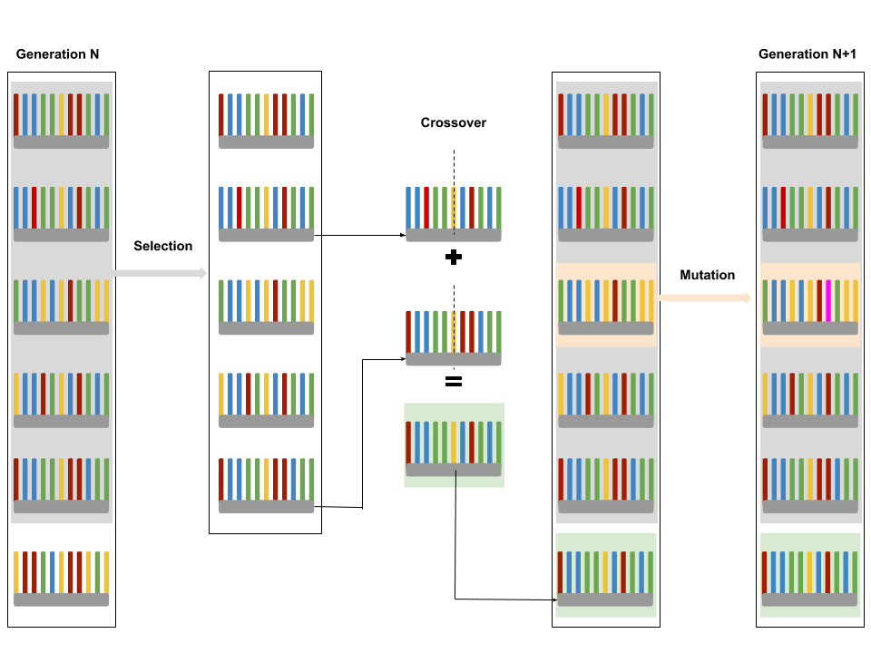
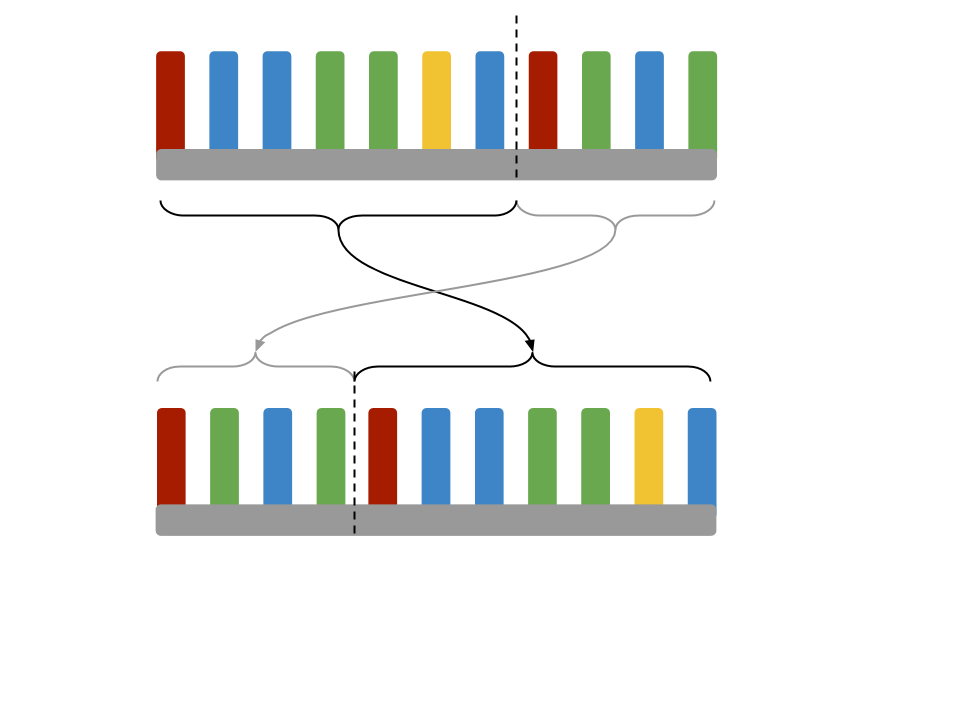

## Genetic Algorithm principle

The genetic algorithms (GA) are evolutionnary algorithms inspired by [Darwin's theory](https://www.darwins-theory-of-evolution.com/). This theory is about the evolution of species. According to him, animal and plant species had to change to survive, adapting to changes in their environment. Only those who survive have descendants, this is called natural selection. The GA's goal is to obtain an approximate solution to an optimization problem, when there is no exact method (or if the solution is unknown) to solve it in a reasonable time.
That is what we will try to implement taking the example of the famous Travelling Salesman Problem

## Travelling salesman problem (TSP)

The [Travelling Salesman Problem](https://en.wikipedia.org/wiki/Travelling_salesman_problem) is easy to understand. The goal is to find the best route, which have the shortest distance, to link each points the salesman wants to visit from a starting point and to this same starting point (here purple on the GIF below). Yet it is an hard tark if we try to resolve it by trying each possibilities. Take the example of trying to find the best route to link 100 points. There is 9.332622e+157 possibilities. To be more precise there is 93 326 215 443 944 152 681 699 238 856 266 700 490 715 968 264 381 621 468 592 963 895 217 599 993 229 915 608 941 463 976 156 518 286 253 697 920 827 223 758 251 185 210 916 864 000 000 000 000 000 000 000 000 possibilities. To compare, the estimate age of the universe is 4,320432e+17 seconds. So we can infer that the solution is impossible to find (in a human time of course) and we will try to approximate the shortest route as the GIF below shows. There is a GA for the TSP of 100 points and that is working... Staggering ! So thank you nature for inspiring us. 


## IT and biology mingle

As I said, the GA are evoultionnary algorithms inspired by the biology. The principles of population evolution are selection the crossover and mutation. The selection in a real life population is the natural selection. The "best" individuals give their genes to their children and they form the new generation and this process is repeated. That is on this point the GA algorithms are inspired by the evolutionnary principles. 

To answer a problem, each individual has a cost or a fitness. These two are similar in inherently but different in the way we see them. For example in the TSP case, we well talk about costs as we are interested in how much the route costs (in distance). On the contrary, in a craking-password case, we will be interested in how much the string found fits with the password, so we talk about fitness.



Firstly there is the selection process. It is a selection according to the best individuals of a generation.
The selection process in an algorithm can be done by several ways :
* Proportionate to the cost/fitness : each individual has a weight proportionate to its cost or fitness. The selection is done by choosing randmly individuals according to their weigth. It is an usual way to do the selection. Yet this selection process in some case can approach [local optimum](https://thinkingandcomputing.com/posts/genetic-algorithms-neural-networks.html) without reaching the global one.
* Proportionate to the rank : this process is really similar to the previous one. It sorts the individuals according to their cost or fitness. The each individuals has a weight proportionate to their rank. The worst has a 1 weight, the second worst has a 2 weight, ..., the best has a N weight.
* By tournament : laucnch several tournaments of size k composed by random individuals of the generation. Take the firsts. The advantage of this method is that it can work on parallel architectures.
* Elitism : The easiest way to do the selection. It takes the k-bests individuals of the generation.
* There is [more diffrent process](https://fr.slideshare.net/riyadparvez/selection-in-evolutionary-algorithm) of course.

The crossover or recombination is the process of creating a child from the genetic information of the parents. I'm not going to shock you by telling you that there are still many ways to create this process.
* The crossover is usually made from 2 parents but it is also possible to make it with k-parents
* One point crossover : choose a limit point (randomly or not) and take the genetic information from the first parent until the limit point chosen. Then add the the genetic information of the second parent starting to the same limit point. To a better understanding you can see the diagram above.
* K-points crossover : it works similarly but their is k limit points and the child is created by alternating the genetic information of each parent.
* Uniform crossover : for each gene, the uniform crossover randomly choose the first parent one or the second parent one.


The last process is the mutation. There is also different cases depending of the individuals. It can randomly replace a gene by an other or interchanges genes.

## Biology in our program

In this section I will explain what are the processes and the variables I choose to resolve the TSP.

First of all, the individuals here are a route linked the `N_POINT`. The population of size `SIZE_POPULATION` is a list of route individuals. For this case, we will use a cost calculation instead of fitness calculation as we don't know what the best result is. The costs will be calculate by the sum of the distance of each edge linked two points to visit. 

Secondly, to get from the n generation to the (n+1) generation :
* Selection : I hesitated between the selction by rank or by eletism. I choose the elitism process as in this problem there is a lot of calculation needed. The elistism process is worth but speeder. So the `RATIO_SELECTION` % bests individals will of the n generation will be selected for the (n+1) generation. 
* Crossover : it will be a [4-points](https://www.tutorialspoint.com/genetic_algorithms/genetic_algorithms_crossover.htm) crossover. The parents for the (n+1) generation will be the individuals previously selected. They will create `RATIO_CROSSOVER` % of `SIZE_POPULATION`.Then while the parents and children number is less htan the `SIZE_POPULATION`, a new random individual is created.
* Mutation : I didn't choose one of the process explained above. For the mutation process on an individual, a random limit gene will be chosen. The mutate the two parts of the individual are interchanged as shown below. 





With those processes, in theory, the population cannot fall into a [local optimum](https://thinkingandcomputing.com/posts/genetic-algorithms-neural-networks.html) indefinitely since individuals are randomly selected and added to each generation. However, in practice, a population is considered to have converged if there is no further improvement after a few generations. Several populations can be relaunched and the stability of the best individuals obtained can be verified (or not). But I will simply choose to define a number `MAX_GENERATION` of generations to be reached. 


## Pseudo Code

```
Set varaiables and parameters
Generate the genesis population
While the maximum iteration isn't reached
    Calculate each individuals costs and sort the generation
    Selection (with elitism selection)
    Crossover (with 4-points crossover)
    Complete with new random individuals while the population size is not reached
    Mutation (with personnnal mutation (might have a name))
    Return the best individual found
```

## Let's start with python

### Individuals

In a `individual.py` file : 

Creation of the individuals and their cost. An individual is made from a list of point taking as a route for argument. The `costFunction()` return its cost, which is the sum of the each point-to-point distance.

```python 
import random

class Individual:

    def __init__(self, _points):
        """
        Initialize a individual from a list of point
        :param _points: list of point the individual is made from
        """
        self.points = [list(point) for _, point in enumerate(_points)]
        self.cost = self.costFunction()

    
    def costFunction(self):
        """
        Calculate the distance needed to link each point
        :return:
        """

        # only create the distance function between two points (Pythagoras)
        def distance(point_1, point_2):
            return (point_1[0] - point_2[0]) ** 2 + (point_1[1] - point_2[1]) ** 2

        # and sum the distances between each point to have the cost value
        cost = 0
        for i in range(len(self.points) - 1):
            cost += distance(self.points[i], self.points[(i + 1)])
        return cost
```
Each individual can be crossed with an other as argument and the function return the child. The crossover process is a 4-points crossover.

```python 
    def crossWith(self, other):
        """
        cross self with other as a 4-points crossover
        :param other: other individuals
        :return: child
        """
        # select randomly the 4-point of te crossover
        genes = [random.randint(0, len(self.points) - 1) for _ in range(4)]
        genes.sort()  # sort them for the use

        points_from_self = self.points[genes[0]:genes[1]]  # first part of self's points
        points_from_self += self.points[genes[2]:genes[3]]  # second part of self's points
        # looking for the missing points
        points_from_other = [point for _, point in enumerate(other.points) if point not in points_from_self]

        # add the parent's point to create the child's list of point
        child_points = points_from_self + points_from_other
        return Individual(child_points)
```

Each individual can mutate. A mutation here is interchanging the left and write part of the genetic information according to a random gene.  

```python 
    def mutate(self):
        """
        mutate an individual
        """
        # select a random gene
        rand_index = random.randint(0, len(self.points) - 1)
        # mutate [a, b, c, d, e, f, g] with rand_index = 2 become [c, d, e, f, g, a, b,]
        point_mutated = self.points[rand_index:]  # [c, d, e, f, g] in the example
        point_mutated += self.points[:rand_index]  # add [a, b] in the example
        self.points = point_mutated[:]
```

the function `toXY()` returns an array X of each x-coordinates and an array Y of each y-coordinates. It will be usefull to plot an individual during the evoltion process. 

```python 
    def toXY(self):
        """
        to return X and Y array of coordinates to plot the individual
        :return: X coordinates, Y coordinates
        """
        # isolate the X and the Y array to return them
        X = [self.points[p][0] for p in range(len(self.points))]
        Y = [self.points[p][1] for p in range(len(self.points))]
        # as the starting point is (0, 0) point, we are looking to the first nearest point
        minDistance = {"index": 0, "distance": X[0] ** 2 + Y[0] ** 2}  # dictionary to easy use
        for i in range(len(X)):
            distance_i = X[i] ** 2 + Y[i] ** 2  # take the distance from (0, 0) f each point
            if distance_i < minDistance["distance"]:  # compare to the best point already found
                # replace it if there is a new nearest point from (0, 0)
                minDistance["index"] = i
                minDistance["distance"] = distance_i

        # surround X, Y by the starting point (0, 0), which is also the ending point
        X = [0] + X[minDistance["index"]:] + X[:minDistance["index"]] + [0]
        Y = [0] + Y[minDistance["index"]:] + Y[:minDistance["index"]] + [0]
        return X, Y
```

### Population

In a `population.py` file : 

Creation of the population composed of individuals. It takes two arguments : the size we are interesd in and an array of the point an individual has to visit. The `newIndividuals()` function will be used to reach the size of interest after the crossovers (cf. pseudo code). And the `randomPopulation()` function will be used to generate a random population. It takes three arguments :  the size of the population we want to create, the size value of the squared-map, where the point can be and the number of random point to visit we to create.

```python 
from individual import *

class Population:
   
   def __init__(self, size, pointList):
        """
        Initialize population of size individuals from a pointList
        :param size: size of the population
        :param pointList: pointList from which the individuals are made from
        """
        self.size = size
        # randomly create individuals from pointList
        self.individuals = [Individual(random.sample(pointList, len(pointList)))
                                       for _ in range(self.size)]
        self.best = self.individuals[0]

    def newIndividuals(self):
        """
        Create a random new Individual while the population size is not equal to the size chosen
        """
        while len(self.individuals) < self.size:
            points = self.individuals[0].points
            new_individual = Individual(random.sample(points, len(points)))
            self.individuals.append(new_individual)


def randomPopulation(size_population, size_plot, n_point):
    """
    Create a new random population
    :param size_population: size of population
    :param size_plot: size of the plot side
    :param n_point: number of point each individuals is made from
    :return: population created
    """
    # create a random array of point to define a new individual
    points = [(random.random() * size_plot, random.random() * size_plot)
              for _ in range(n_point)]
    return Population(size_population, points)
```
The ascending sort of individuals is done according to their cost. The best is then the first in the array. The selection process is an elitism process taking for argument the ratio of how many individuals we want to retain.

```python 
    def sort(self):
        """
        sort the individuals according to their cost
        """
        self.individuals.sort(key=lambda individual: individual.cost)
        # change the best individuals if the new best one beats the latest one
        if self.best.cost >= self.individuals[0].cost:
            self.best = self.individuals[0]

    # region genetic
    def selection(self, ratio_selection):
        """
        The selection here is to keep the ratio_selection% bests
        :param ratio_selection: selection ratio of interest
        """
        self.individuals = [self.individuals[individual]
                            for individual in range(int(ratio_selection*len(self.individuals)))]
```

The crossover is made between the retained individuals. They are randomly chosen to create children. The `crossover()` function take for argument a ratio of the population size to reach. A 0.3 ratio in a 100-individuals desired population will created 30 children for example.

```python 
    def crossover(self, ratio_crossover, ratio_selection):
        """
        Crossover the selected individuals
        :param ratio_crossover: child ratio from crossover of interest
        :param ratio_selection: selection ratio of interest
        """
        # count the number of parents after the selection
        potential_parent_count = int(ratio_selection * self.size - 1)
        for _ in range(int(ratio_crossover * self.size)):
            # select a first parent
            parent_1_index = random.randint(0,potential_parent_count)
            # select a second parent (different than the first one)
            parent_2_index = random.randint(0,potential_parent_count)
            # verify they are different or change the second parent
            while parent_1_index == parent_2_index:
                parent_2_index = random.randint(0, potential_parent_count)
            self.individuals.append(self.individuals[parent_1_index].crossWith(self.individuals[parent_2_index]))

```

The `mutation()` function needs also for argument a ratio based on the population size. 

```python 
    def mutation(self, ratio_mutation):
        """
        Mutate randomly the population according to the ratio chosen
        :param ratio_mutation: mutation ratio of interest
        """
        for _ in range(int(ratio_mutation * self.size)):
            # select a random individual
            individual_index = random.randint(0, self.size - 1)
            self.individuals[individual_index].mutate()
```

All the function to get the (n+1) generation from the n generation to are now written. The `nextGeneration()` function puts the processes together.

```python 
    def nextGeneration(self, ratio_selection, ratio_crossover, ratio_mutation):
        """
        Next generation process
        :param ratio_selection: selection ratio of interest
        :param ratio_crossover: child ratio from crossover of interest
        :param ratio_mutation: mutation ratio of interest
        """
        self.sort()  # sort the individuals according to their cost
        self.selection(ratio_selection)  # selection process according to the ratio chosen
        self.crossover(ratio_crossover, ratio_selection)  # crossover process according to the ratio chosen
        self.newIndividuals()  # create new individuals if needed
        self.mutation(ratio_mutation)  # mutation process according to the ratio chosen
```

### Genetic Generation and plot

In a `geneticAlgorithm.py` file : 

We need to import matplotlib.pyplot to show the population and matplotlib.animation to show it dynamically.

```python
import matplotlib.pyplot as plt
import matplotlib.animation as animation
from population import *
```

There is a lot of variables to consider respectively ogganized in groupe for pseudo-constants, the population and the plot. 

```python
SIZE_PLOT = 10
DISPLAY_GENERATION = 5  # Display the best individuals each DISPLAY_GENERATION
N_POINT = 30  # Number of point to link
SIZE_POPULATION = 150  # Size of each population
MAX_GENERATION = 500  # Stop running at MAX_GENERATION
# each new generation is composed by :
# --> RATIO_SELECTION of the best individuals in the previous generation
# --> RATIO_CROSSOVER of children of the best individuals children
# --> The rest is new random individuals to minimize the chance to be in a local minimum
RATIO_SELECTION = 0.3
RATIO_CROSSOVER = 0.65
# each new generation is subject to a RATIO_MUTATION
RATIO_MUTATION = 0.7

# Initialize the first randomized population
population = randomPopulation(SIZE_POPULATION, SIZE_PLOT, N_POINT)
generation_count = 0
# costs array to keep the best cost value of each generation
costs = []

# Initialize the two plot
figGen = plt.figure(1)  # display the best cost according to the generation number
fig = plt.figure(0)  # display the best cost for actual generation

ax = fig.add_subplot(1,1,1)  # plot for the post visualization
axGen = figGen.add_subplot(1,1,1)  # plot for the costs evolution

ani = None  # to animate (update) the two plots
started = False
```

We create of function to display in two plots the data. A first plot is representing the best individuals found. A second plot is showing the evolution of the best cost found in accordance with the number of the generation. The `key_pressed()` is made to launch/pause the evolution when pressing on the enter key.

```python 
def display():
    """
    Udpdates the two plots
    """
    # First, clear the plots
    ax.clear()
    axGen.clear()

    # actualize plot title and axes labels
    ax.set_title("Generation : {0}".format(generation_count))
    axGen.set_xlabel("Generation")
    axGen.set_ylabel("best cost")
    # Ask for the best cost in two vectors (X coord and Y coord)
    X, Y = population.best.toXY()

    # place the N_POINT point (except starting-ending point coord(0, 0))
    plt.scatter(X[1:-1], Y[1:-1], c='#474747')
    # then place the starting-ending point
    plt.scatter(0, 0, c='#8800FF')

    if started:
        # show how the N_POINT are linked in the best cost case found
        ax.plot(X, Y, c='#2F9599', )
        # actualize the plot of costs
        axGen.plot([i for i in range(len(costs))], costs, c='#2F9599')
    axGen.set_xlim([0, MAX_GENERATION])  # to keep the same abscissa
    # the show the plots
    fig.canvas.draw()
    figGen.canvas.draw()

def key_pressed(event):
    """
    To start/pause running the programme
    :param event: key_press_event
    """
    if event.key == 'enter':
        global started
        started = not started
```

The `nextGeneration()` function waits for the start and throw the displaying function.

```python
def nextGeneration(frame_number):
    """
    Update for new generation of the population
    :param frame_number:
    """
    if started:
        global generation_count
        while generation_count < MAX_GENERATION:
            population.nextGeneration(RATIO_SELECTION, RATIO_CROSSOVER, RATIO_MUTATION)
            generation_count += 1
            costs.append(population.best.cost)  # actualize the best costs array
            # then display the new update
            if generation_count % DISPLAY_GENERATION == 0:
                display()
        figGen.canvas.draw()
```

Each function is completed. We can now run the code. 

```python
if __name__ == "__main__":
    # to animate the plot and launch the population update
    ani = animation.FuncAnimation(fig, nextGeneration)
    # connect to the key press event to start/pause the programme
    fig.canvas.mpl_connect('key_press_event', key_pressed)
    display()
    plt.show()
```


